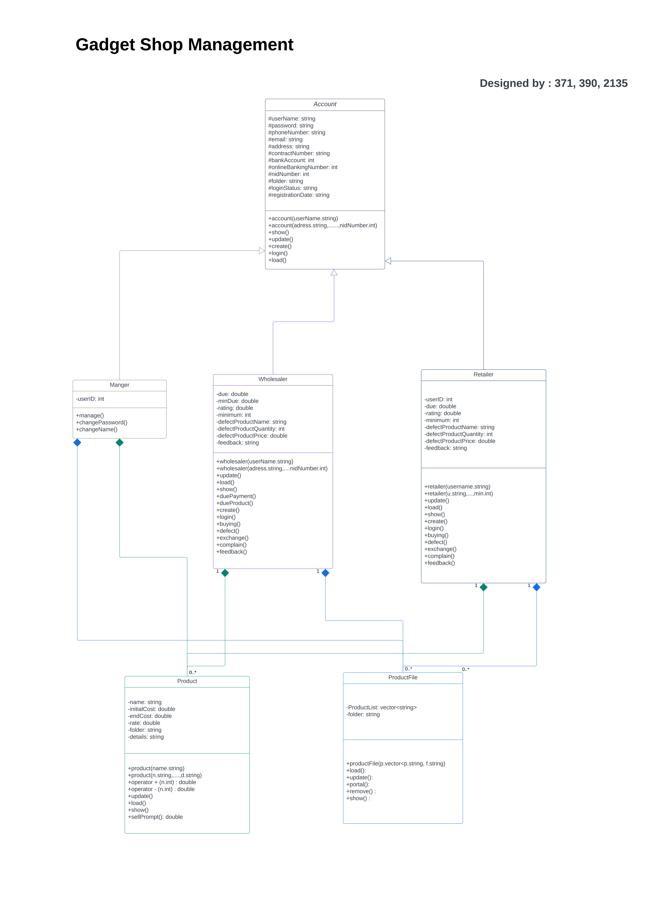

### Project completed on 11-Feb-2024
# Gadget Shop Management System

A comprehensive C++ based management system for handling gadget shop operations, including wholesalers, retailers, and product management. Done in CodeBlocks IDE.

## Overview

This project implements a complete gadget shop management system using Object-Oriented Programming principles in C++. The system manages different types of users (Wholesalers and Retailers), product inventory, and transactions.

## Features

- **User Management**
  - Wholesaler accounts
  - Retailer accounts
  - Secure login system
  - Account balance management

- **Product Management**
  - Product inventory tracking
  - Product details management
  - Stock updates
  - Price management

- **Transaction System**
  - Purchase tracking
  - Balance management
  - Transaction history
  - Discount handling

## Object-Oriented Programming Concepts Used

### 1. Inheritance
- Base class: `Account`
  - Derived classes: `Wholesaler` and `Retailer`
  - Implements common functionality for all account types

### 2. Encapsulation
- Private data members in all classes
- Public methods for controlled access
- Protected members for inheritance

### 3. Polymorphism
- Virtual functions in base class
- Overridden methods in derived classes
- Runtime polymorphism for account operations

### 4. Abstraction
- Abstract data types for products and accounts
- Interface-based design for operations
- Data hiding through private members

## Class Structure

### Core Classes
1. **Account** (Base Class)
   - Username and password management
   - Basic account operations

2. **Wholesaler** (Derived from Account)
   - Wholesale-specific operations
   - Balance management
   - Product purchase history

3. **Retailer** (Derived from Account)
   - Retail-specific operations
   - Balance tracking
   - Purchase records

4. **Product**
   - Product details
   - Stock management
   - Price information

5. **ProductList**
   - Product inventory management
   - Stock updates
   - Product search and filtering

6. **CustomerList**
   - User account management
   - Login system
   - Account creation and updates

## File Structure

- **Binary Files**
  - `Wholesalers.bin`: Stores wholesaler account data
  - `Retailers.bin`: Stores retailer account data
  - `Products.bin`: Stores product inventory data
  - `Employees.bin`: Stores employee data

- **Text Files**
  - `AdminUsernamePass.txt`: Admin credentials
  - `Profit.txt`: Profit tracking

## How to Run

1. Ensure you have Code::Blocks IDE installed
2. Open the project file `gadgetshop.cbp`
3. Build and run the project (F9 or Build and Run button)

## User Interface

### Main Menu
- Customer Options
- Admin Options
- Exit Program

### Customer Portal
1. Wholesaler Service
   - Login/Signup
   - Buy Products
   - View Account Details
   - Add Balance

2. Retailer Service
   - Login/Signup
   - Buy Products
   - View Account Details
   - Add Balance

## Security Features

- Password protection for accounts
- Separate admin and user interfaces
- Transaction tracking
- Balance verification

## Data Persistence

The system uses binary files for data storage, ensuring:
- Fast data access
- Efficient storage
- Data persistence between sessions
- Secure data handling

## Contact Information
- GitHub: [https://github.com/AhadSiddiki]
- Email: [ahad.siddiki25@gmail.com]
- LinkedIn: [http://www.linkedin.com/in/ahad-siddiki/]
- Instagram: [www.instagram.com/ahad.siddiki/]